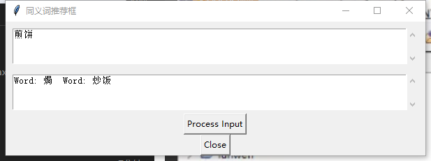

## Gensim-word2vec Readme

**Edited** by Xsfsss

由于data过大，请自行于**dumps.wikimedia.org/zhwiki**下载

#### 简介

Word2Vec 是一种用于将词汇映射到向量表示的技术，它是基于分布式假设的词嵌入模型。这意味着Word2Vec会将每个单词映射到一个高维向量空间中的向量，这些向量会被设计成能够捕捉单词之间的语义和语法关系。Word2Vec 的核心思想是：上下文相似的单词在向量空间中也应该相似，本案例中使用的是Wiki自带的解析bz2程序和jieba分词器

**项目学习来源于唐老师**

#### To start

Environment

```
pip install gensim
pip install jieba
```

#### 从Wiki下载好中文语料库

```
cmd运行
python bz2toTxt.py -i NameOfProject.xml.bz2 -o NameOfTxt.txt
```

#### 如果是繁体字可以使用Opencc转录成简体

此处不细讲教程，繁体也可以继续操作，只不过最后的input需要繁体，否则会无法检录该词汇

#### 使用jieba分词器分词

```
python Usejieba.py 
#这里需要在.py文件中制定好文件名和输出文件名
```

```python
f=codecs.open('zHtest.txt','r',encoding="utf8") #读取文件名
target = codecs.open("zHwiki.seg.txt", 'w',encoding="utf8") #写入文件名
```

#### 使用word2vec获取model

```
python word2vec_model.py zHwiki.seg.txt wiki.zh.text.model wiki.zh.text.vector
```


最后的测试在类似词推荐demoGUI中：




感谢观看